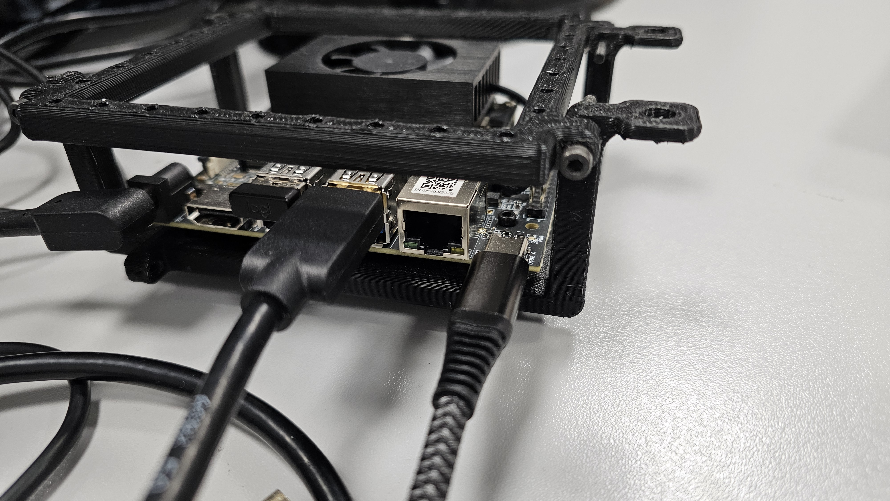

Steps to configure any Xavier/Orin NX/AGX board to connect to PSDK. (THIS IS ONLY DONE ONCE)

- Disable l4t-device-mode auto start (This is only performed once): ``` sudo systemctl disable nv-l4t-usb-device-mode.service ```

- Grab bulk mode program folder https://terra-1-g.djicdn.com/71a7d383e71a4fb8887a310eb746b47f/psdk/e-port/usb-bulk-configuration-reference.zip and place it in ~/Desktop under the name of startup_bulk: 
``` wget https://terra-1-g.djicdn.com/71a7d383e71a4fb8887a310eb746b47f/psdk/e-port/usb-bulk-configuration-reference.zip && unzip usb-bulk-configuration-reference.zip -d startup_bulk && mv startup_bulk/ ~/Desktop/ ```

- Replace system device mode for mine:
``` sudo cp ./nv-l4t-usb-device-mode-start.sh /opt/nvidia/l4t-usb-device-mode/nv-l4t-usb-device-mode-start.sh ```
and
```chmod +x ./nv-l4t-usb-device-mode-start.sh```

- Reboot

- Load necessary kernel modules on boot:
```echo -e "configfs\nlibcomposite\nusb_f_fs\ntegra-xudc" | sudo tee -a /etc/modules```
(check the file /etc/modules is correctly formatted)

- Execute to see if it works:
```/opt/nvidia/l4t-usb-device-mode/nv-l4t-usb-device-mode-start.sh```

- If it works, re-enable the service:
```sudo systemctl enable /opt/nvidia/l4t-usb-device-mode/nv-l4t-usb-device-mode.service```

Now the bulk mode and the network mode should be properly configured (yes, both). So what you want to do now differs depending on wheter you are working on M300, or M350/M30. (THIS MUST BE DONE EVERYTIME THE BOARD BOOTS UP)

- M300:
    - Hardware:
        - Onboard computer will be host, eport will be device, so:
        
        - On the AGX, connections will look like this:
        
        It is very important that the type-c cable is in that port, it is the one that supports both bulk and host mode.
    - Software:
        - Enable host mode on onboard computer:
        ```echo host | sudo tee /sys/class/usb_role/usb2-0-role-switch/role```
        Now you should see /dev/ttyACM0 when turning on the drone.


- M350:
    - Hardware:
        - Onboard computer will be device, eport will be host, so:
        
        - On the AGX, connections will look like this aswel:
        
    - Software:
        - Enable device mode on onboard computer:
        ```echo host | sudo tee /sys/class/usb_role/usb2-0-role-switch/role```  
        - Lift up l4tbr0 connection:
        ```sudo ifconfig usb0 192.168.1.1 netmask 255.255.255.0 up```
        Now you should see with ```ifconfig``` command "l4tbr0" entry. If not, repeat steps above. 

- M30:
    - Hardware:
        - Onboard computer will be device, eport will be host, so:
        
        - On the nx, connections will look like this aswel:
        
    - Software:
        - Enable device mode on onboard computer:
        ```echo host | sudo tee /sys/class/usb_role/usb2-0-role-switch/role```  
        - Lift up l4tbr0 connection:
        ```sudo ifconfig usb0 192.168.1.1 netmask 255.255.255.0 up```
        Now you should see with ```ifconfig``` command "l4tbr0" entry. If not, repeat steps above.
